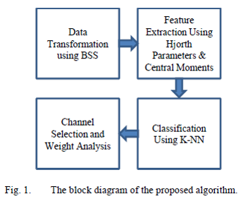

# Topographical Representation in an Associative Learning Task Using BSS Analysis on MEG Signals

One of the most famous kinds of the learning is Associative Learning (AL). It occurs when a subject is confronted with two stimuli, or one stimulus and one behavior continually. The goal of this paper is to identify the regions of the human brain associated to the AL. To do so, the MEG data from two subjects in an AL-based task were used. The data is then mapped into sources domain by Blind Source Separation (BSS) algorithm, then two features of Hjorth parameters and central moments were individually applied to each sorted sources for all trials. Afterwards, the resulting observations were classified by k-NN classifier. Finally, sources with the highest accuracies are selected and their corresponding channels are considered to illustrate the topographical representation. Our experimental results show that, the temporal lobe especially the occipitotemporal and frontotemporal lobes, while are symmetric with respect to the longitudinal fissure, play an important role in AL.

# How to cite
* F. Afdideh et al., "Topographical Representation in an Associative Learning Task Using BSS Analysis on MEG Signals", to be published.
